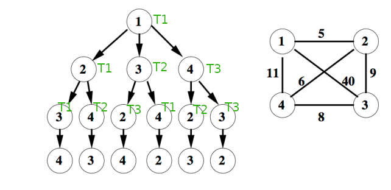

# MA-PCM

## Projet : Branch & Bound

**Diego Vilagrassa**
**Pierre-Benjamin Monaco**

## Système

L'idée de base est de rassembler les noeuds à visiter dans une queue thread safe et de laisser les threads prendre un noeud dans la queue et travailler dessus.
Le risque de cette méthode est de passer plus de temps à remplir et vider la queue qu'à calculer le poids des chemins. Il faut donc permettre à chaque thread d'utiliser sa propre queue (non partagée) et d'effectuer un parcours d'une profondeur variable en fonction d'une configuration initiale ou de manière dynamique.
Il est prévu d'analyser les performances de la structure partagée et celles de l'algorithme dans les thread ppur ensuite fine-tuner le système.

